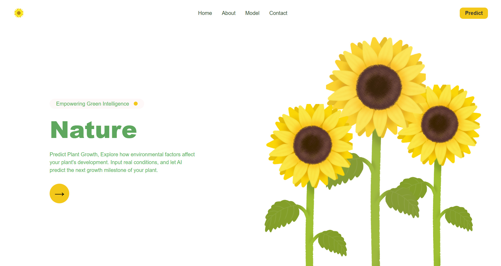

# 🌱 Plant Growth Predictor

An end-to-end web application that predicts plant growth milestones based on user input including sunlight, water frequency, fertilizer type, temperature, and humidity. Built using **FastAPI** for the backend and **React** for the frontend.

---

## 🚀 Getting Started

### 🧠 Prerequisites

- Python 3.8+
- Node.js & npm
- Git

---

## 🛠 Backend Setup (FastAPI)

1. Navigate to backend folder:
    ```bash
    cd backend
    ```

2. Activate the virtual environment:

    - **Windows**
        ```bash
        .\env\Scripts\activate
        ```
    - **macOS/Linux**
        ```bash
        source env/bin/activate
        ```

3. Install dependencies:
    ```bash
    pip install -r requirements.txt
    ```

4. Run the FastAPI server:
    ```bash
    uvicorn app:app --reload
    ```

---

## 💻 Frontend Setup (React)

1. Navigate to frontend folder:
    ```bash
    cd frontend
    ```

2. Install dependencies:
    ```bash
    npm install
    ```

3. Run the React app:
    ```bash
    npm start
    ```

- App runs on: [http://localhost:3000](http://localhost:3000)

---

## 🌐 API Endpoint

| Method | Endpoint  | Description              |
|--------|-----------|--------------------------|
| POST   | `/predict` | Predict plant growth stage |


```md
### 📥 Example Request

```json
{
  "Soil_Type": "clay",
  "Sunlight_Hours": 6.5,
  "Water_Frequency": "daily",
  "Fertilizer_Type": "organic",
  "Temperature": 24.0,
  "Humidity": 60.0
}


## 📸 UI Preview



## 📦 Built With
- 🐍 **FastAPI** — Fast modern Python web framework
- ⚛️ **React** — For building the frontend UI
- 🔀 **CORS Middleware** — Cross-Origin setup
- 🧪 **ML**: ML model for predictions (integrated in `model/`)

## 📜 License
This project is licensed under the MIT License.

## 🙌 Acknowledgements
Thanks to nature, science, and machine learning 💚.
