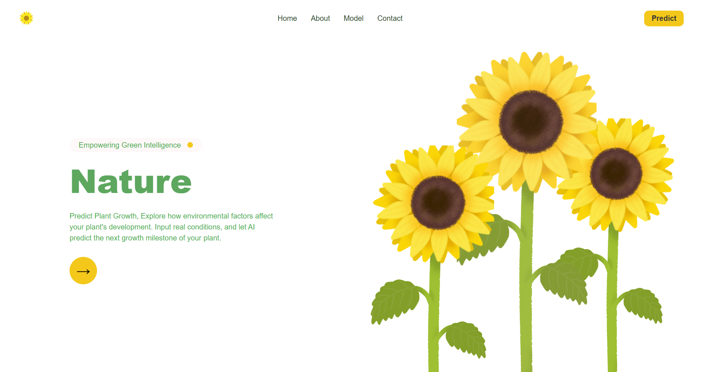

# Plant Growth Predictor

An end-to-end web application that predicts plant growth milestones based on user input including sunlight, water frequency, fertilizer type, temperature, and humidity. Built using **FastAPI** for the backend and **React** for the frontend. Dockerized for easy deployment.

---

### Prerequisites

- Python 3.8+
- Node.js & npm
- Git

---
## Overview

This repository contains the source code and Docker configuration for the Plant Growth Predictor application. It exposes a REST API for predictions and a web UI to interact with the model.

---

## Getting Started with Docker Hub

You can quickly get started by pulling the pre-built Docker image from Docker Hub and running it locally.

### Prerequisites

* Docker installed (Engine and CLI)

### Pulling the Image

```bash
docker pull bouachrineyassine/plant-growth-predictor:latest
```

### Running the Container

```bash
docker run -d \
  --name plant-growth-predictor \
  -p 8000:8000 \
  -p 3000:3000 \
  bouachrineyassine/plant-growth-predictor:latest
```

* **Backend** available at: `http://localhost:8000`
* **Frontend** available at: `http://localhost:3000`

> If ports `8000` or `3000` are already in use, change `-p host_port:container_port` accordingly.

---

## Local Development 

If you want to run the application from source for development:

### Clone the Repository

```bash
git clone https://github.com/yassinebouachrine/plant-growth-predictor.git
cd plant-growth-predictor
```

### Backend Setup (FastAPI)

1. Navigate to the backend folder:

   ```bash
   cd backend
   ```

2. Create and activate a virtual environment:

   ```bash
   python3 -m venv env
   source env/bin/activate   # macOS/Linux
   .\env\Scripts\activate  # Windows
   ```

3. Install Python dependencies:

   ```bash
   pip install -r requirements.txt
   ```

4. Start the FastAPI server:

   ```bash
   uvicorn app:app --reload --host 0.0.0.0 --port 8000
   ```

### Frontend Setup (React)

1. In another terminal, navigate to the frontend folder:

   ```bash
   cd frontend
   ```

2. Install Node.js dependencies:

   ```bash
   npm install
   ```

3. Start the React development server:

   ```bash
   npm start
   ```

---

## API Reference

### Predict Growth Stage

* **URL:** `/predict`
* **Method:** `POST`
* **Content-Type:** `application/json`

#### Request Body Example

```json
{
  "Soil_Type": "clay",
  "Sunlight_Hours": 6.5,
  "Water_Frequency": "daily",
  "Fertilizer_Type": "organic",
  "Temperature": 24.0,
  "Humidity": 60.0
}
```

#### Response Example

```json
{
  "predicted_stage": "Vegetative",
  "confidence": 0.87
}
```

---

## UI Preview



---

## Built With

* 🐍 **FastAPI** — Fast modern Python web framework
* ⚛️ **React** — For building the frontend UI
* 🐳 **Docker** — Containerization
* 🔀 **CORS Middleware** — Cross-Origin setup
* 🧪 **Scikit-learn** — ML model for predictions

---


## Acknowledgements

Thanks to nature, science, and machine learning 💚.

